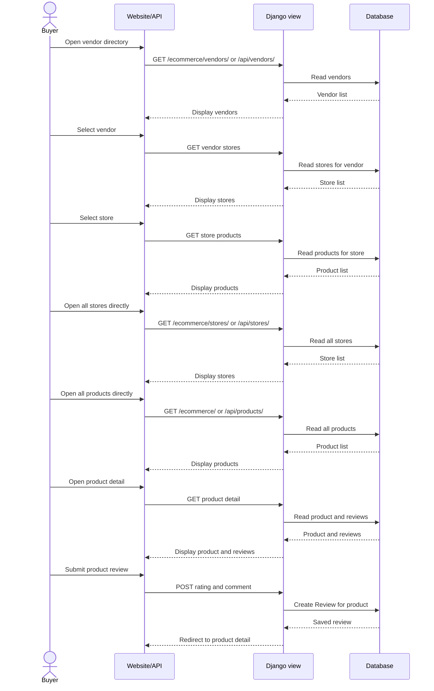

# Buyer Sequence Diagrams

These diagrams cover the Part 2 buyer review and retrieval use cases.

## Browse From Vendors, Stores, or Products and Review

```mermaid
sequenceDiagram
    actor Buyer
    participant UI as Website/API
    participant View as Django view
    participant DB as Database

    Buyer->>UI: Open vendor directory
    UI->>View: GET /ecommerce/vendors/ or /api/vendors/
    View->>DB: Read vendors
    DB-->>View: Vendor list
    View-->>UI: Display vendors

    Buyer->>UI: Select vendor
    UI->>View: GET vendor stores
    View->>DB: Read stores for vendor
    DB-->>View: Store list
    View-->>UI: Display stores

    Buyer->>UI: Select store
    UI->>View: GET store products
    View->>DB: Read products for store
    DB-->>View: Product list
    View-->>UI: Display products

    Buyer->>UI: Open all stores directly
    UI->>View: GET /ecommerce/stores/ or /api/stores/
    View->>DB: Read all stores
    DB-->>View: Store list
    View-->>UI: Display stores

    Buyer->>UI: Open all products directly
    UI->>View: GET /ecommerce/ or /api/products/
    View->>DB: Read all products
    DB-->>View: Product list
    View-->>UI: Display products

    Buyer->>UI: Open product detail
    UI->>View: GET product detail
    View->>DB: Read product and reviews
    DB-->>View: Product and reviews
    View-->>UI: Display product and reviews

    Buyer->>UI: Submit product review
    UI->>View: POST rating and comment
    View->>DB: Create Review for product
    DB-->>View: Saved review
    View-->>UI: Redirect to product detail
```
