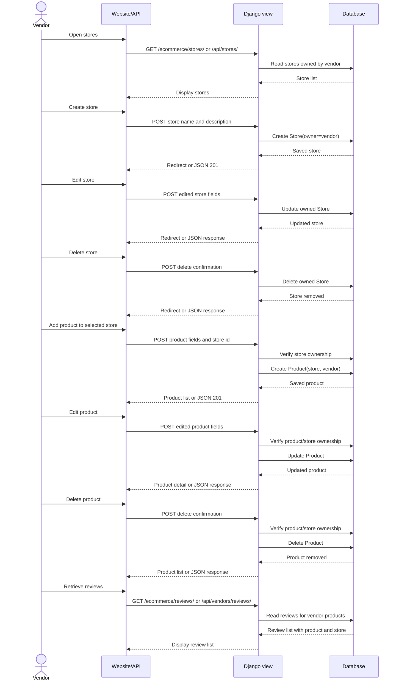

# Vendor Sequence Diagrams

These diagrams cover the Part 2 vendor use cases. The vendor may use the website or the equivalent JSON endpoint.

## Store CRUD, Product CRUD, and Review Retrieval

```mermaid
sequenceDiagram
    actor Vendor
    participant UI as Website/API
    participant View as Django view
    participant DB as Database

    Vendor->>UI: Open stores
    UI->>View: GET /ecommerce/stores/ or /api/stores/
    View->>DB: Read stores owned by vendor
    DB-->>View: Store list
    View-->>UI: Display stores

    Vendor->>UI: Create store
    UI->>View: POST store name and description
    View->>DB: Create Store(owner=vendor)
    DB-->>View: Saved store
    View-->>UI: Redirect or JSON 201

    Vendor->>UI: Edit store
    UI->>View: POST edited store fields
    View->>DB: Update owned Store
    DB-->>View: Updated store
    View-->>UI: Redirect or JSON response

    Vendor->>UI: Delete store
    UI->>View: POST delete confirmation
    View->>DB: Delete owned Store
    DB-->>View: Store removed
    View-->>UI: Redirect or JSON response

    Vendor->>UI: Add product to selected store
    UI->>View: POST product fields and store id
    View->>DB: Verify store ownership
    View->>DB: Create Product(store, vendor)
    DB-->>View: Saved product
    View-->>UI: Product list or JSON 201

    Vendor->>UI: Edit product
    UI->>View: POST edited product fields
    View->>DB: Verify product/store ownership
    View->>DB: Update Product
    DB-->>View: Updated product
    View-->>UI: Product detail or JSON response

    Vendor->>UI: Delete product
    UI->>View: POST delete confirmation
    View->>DB: Verify product/store ownership
    View->>DB: Delete Product
    DB-->>View: Product removed
    View-->>UI: Product list or JSON response

    Vendor->>UI: Retrieve reviews
    UI->>View: GET /ecommerce/reviews/ or /api/vendors/reviews/
    View->>DB: Read reviews for vendor products
    DB-->>View: Review list with product and store
    View-->>UI: Display review list
```
